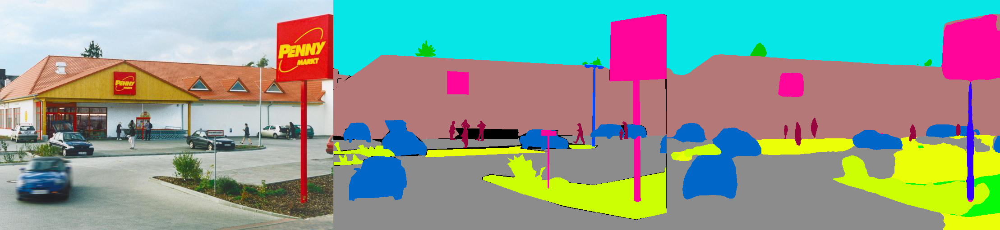

# Semantic Segmentation on MIT ADE20K dataset in PyTorch

This is a PyTorch implementation of semantic segmentation models on MIT ADE20K scene parsing dataset (http://sceneparsing.csail.mit.edu/).

ADE20K is the largest open source dataset for semantic segmentation and scene parsing, released by MIT Computer Vision team. Follow the link below to find the repository for our dataset and implementations on Caffe and Torch7:
https://github.com/CSAILVision/sceneparsing

If you simply want to play with our demo, please try this link: http://scenesegmentation.csail.mit.edu You can upload your own photo and parse it!

[You can also use this colab notebook playground here](https://colab.research.google.com/github/CSAILVision/semantic-segmentation-pytorch/blob/master/notebooks/DemoSegmenter.ipynb) to tinker with the code for segmenting an image.

All pretrained models can be found at:
http://sceneparsing.csail.mit.edu/model/pytorch



[From left to right: Test Image, Ground Truth, Predicted Result]

Color encoding of semantic categories can be found here:
https://docs.google.com/spreadsheets/d/1se8YEtb2detS7OuPE86fXGyD269pMycAWe2mtKUj2W8/edit?usp=sharing

## Updates
- HRNet model is now supported.
- We use configuration files to store most options which were in argument parser. The definitions of options are detailed in ```config/defaults.py```.
- We conform to Pytorch practice in data preprocessing (RGB [0, 1], substract mean, divide std).


## Highlights

### Syncronized Batch Normalization on PyTorch
This module computes the mean and standard-deviation across all devices during training. We empirically find that a reasonable large batch size is important for segmentation. We thank [Jiayuan Mao](http://vccy.xyz/) for his kind contributions, please refer to [Synchronized-BatchNorm-PyTorch](https://github.com/vacancy/Synchronized-BatchNorm-PyTorch) for details.

The implementation is easy to use as:
- It is pure-python, no C++ extra extension libs.
- It is completely compatible with PyTorch's implementation. Specifically, it uses unbiased variance to update the moving average, and use sqrt(max(var, eps)) instead of sqrt(var + eps).
- It is efficient, only 20% to 30% slower than UnsyncBN.

### Dynamic scales of input for training with multiple GPUs 
For the task of semantic segmentation, it is good to keep aspect ratio of images during training. So we re-implement the `DataParallel` module, and make it support distributing data to multiple GPUs in python dict, so that each gpu can process images of different sizes. At the same time, the dataloader also operates differently. 

<sup>*Now the batch size of a dataloader always equals to the number of GPUs*, each element will be sent to a GPU. It is also compatible with multi-processing. Note that the file index for the multi-processing dataloader is stored on the master process, which is in contradict to our goal that each worker maintains its own file list. So we use a trick that although the master process still gives dataloader an index for `__getitem__` function, we just ignore such request and send a random batch dict. Also, *the multiple workers forked by the dataloader all have the same seed*, you will find that multiple workers will yield exactly the same data, if we use the above-mentioned trick directly. Therefore, we add one line of code which sets the defaut seed for `numpy.random` before activating multiple worker in dataloader.</sup>

### State-of-the-Art models
- **PSPNet** is scene parsing network that aggregates global representation with Pyramid Pooling Module (PPM). It is the winner model of ILSVRC'16 MIT Scene Parsing Challenge. Please refer to [https://arxiv.org/abs/1612.01105](https://arxiv.org/abs/1612.01105) for details.
- **UPerNet** is a model based on Feature Pyramid Network (FPN) and Pyramid Pooling Module (PPM). It doesn't need dilated convolution, an operator that is time-and-memory consuming. *Without bells and whistles*, it is comparable or even better compared with PSPNet, while requiring much shorter training time and less GPU memory. Please refer to [https://arxiv.org/abs/1807.10221](https://arxiv.org/abs/1807.10221) for details.
- **HRNet** is a recently proposed model that retains high resolution representations throughout the model, without the traditional bottleneck design. It achieves the SOTA performance on a series of pixel labeling tasks. Please refer to [https://arxiv.org/abs/1904.04514](https://arxiv.org/abs/1904.04514) for details.


## Supported models
We split our models into encoder and decoder, where encoders are usually modified directly from classification networks, and decoders consist of final convolutions and upsampling. We have provided some pre-configured models in the ```config``` folder.

Encoder:
- MobileNetV2dilated
- ResNet18/ResNet18dilated
- ResNet50/ResNet50dilated
- ResNet101/ResNet101dilated
- HRNetV2 (W48)

Decoder:
- C1 (one convolution module)
- C1_deepsup (C1 + deep supervision trick)
- PPM (Pyramid Pooling Module, see [PSPNet](https://hszhao.github.io/projects/pspnet) paper for details.)
- PPM_deepsup (PPM + deep supervision trick)
- UPerNet (Pyramid Pooling + FPN head, see [UperNet](https://arxiv.org/abs/1807.10221) for details.)

## Performance:
IMPORTANT: The base ResNet in our repository is a customized (different from the one in torchvision). The base models will be automatically downloaded when needed.

<table><tbody>
    <th valign="bottom">Architecture</th>
    <th valign="bottom">MultiScale Testing</th>
    <th valign="bottom">Mean IoU</th>
    <th valign="bottom">Pixel Accuracy(%)</th>
    <th valign="bottom">Overall Score</th>
    <th valign="bottom">Inference Speed(fps)</th>
    <tr>
        <td rowspan="2">MobileNetV2dilated + C1_deepsup</td>
        <td>No</td><td>34.84</td><td>75.75</td><td>54.07</td>
        <td>17.2</td>
    </tr>
    <tr>
        <td>Yes</td><td>33.84</td><td>76.80</td><td>55.32</td>
        <td>10.3</td>
    </tr>
    <tr>
        <td rowspan="2">MobileNetV2dilated + PPM_deepsup</td>
        <td>No</td><td>35.76</td><td>77.77</td><td>56.27</td>
        <td>14.9</td>
    </tr>
    <tr>
        <td>Yes</td><td>36.28</td><td>78.26</td><td>57.27</td>
        <td>6.7</td>
    </tr>
    <tr>
        <td rowspan="2">ResNet18dilated + C1_deepsup</td>
        <td>No</td><td>33.82</td><td>76.05</td><td>54.94</td>
        <td>13.9</td>
    </tr>
    <tr>
        <td>Yes</td><td>35.34</td><td>77.41</td><td>56.38</td>
        <td>5.8</td>
    </tr>
    <tr>
        <td rowspan="2">ResNet18dilated + PPM_deepsup</td>
        <td>No</td><td>38.00</td><td>78.64</td><td>58.32</td>
        <td>11.7</td>
    </tr>
    <tr>
        <td>Yes</td><td>38.81</td><td>79.29</td><td>59.05</td>
        <td>4.2</td>
    </tr>
    <tr>
        <td rowspan="2">ResNet50dilated + PPM_deepsup</td>
        <td>No</td><td>41.26</td><td>79.73</td><td>60.50</td>
        <td>8.3</td>
    </tr>
    <tr>
        <td>Yes</td><td>42.14</td><td>80.13</td><td>61.14</td>
        <td>2.6</td>
    </tr>
    <tr>
        <td rowspan="2">ResNet101dilated + PPM_deepsup</td>
        <td>No</td><td>42.19</td><td>80.59</td><td>61.39</td>
        <td>6.8</td>
    </tr>
    <tr>
        <td>Yes</td><td>42.53</td><td>80.91</td><td>61.72</td>
        <td>2.0</td>
    </tr>
    <tr>
        <td rowspan="2">UperNet50</td>
        <td>No</td><td>40.44</td><td>79.80</td><td>60.12</td>
        <td>8.4</td>
    </tr>
    <tr>
        <td>Yes</td><td>41.55</td><td>80.23</td><td>60.89</td>
        <td>2.9</td>
    </tr>
    <tr>
        <td rowspan="2">UperNet101</td>
        <td>No</td><td>42.00</td><td>80.79</td><td>61.40</td>
        <td>7.8</td>
    </tr>
    <tr>
        <td>Yes</td><td>42.66</td><td>81.01</td><td>61.84</td>
        <td>2.3</td>
    </tr>
    <tr>
        <td rowspan="2">HRNetV2</td>
        <td>No</td><td>42.03</td><td>80.77</td><td>61.40</td>
        <td>5.8</td>
    </tr>
    <tr>
        <td>Yes</td><td>43.20</td><td>81.47</td><td>62.34</td>
        <td>1.9</td>
    </tr>

</tbody></table>

The training is benchmarked on a server with 8 NVIDIA Pascal Titan Xp GPUs (12GB GPU memory), the inference speed is benchmarked a single NVIDIA Pascal Titan Xp GPU, without visualization.

## Environment
The code is developed under the following configurations.
- Hardware: >=4 GPUs for training, >=1 GPU for testing (set ```[--gpus GPUS]``` accordingly)
- Software: Ubuntu 16.04.3 LTS, ***CUDA>=8.0, Python>=3.5, PyTorch>=0.4.0***
- Dependencies: numpy, scipy, opencv, yacs, tqdm

## Quick start: Test on an image using our trained model 
1. Here is a simple demo to do inference on a single image:
```bash
chmod +x demo_test.sh
./demo_test.sh
```
This script downloads a trained model (ResNet50dilated + PPM_deepsup) and a test image, runs the test script, and saves predicted segmentation (.png) to the working directory.

2. To test on an image or a folder of images (```$PATH_IMG```), you can simply do the following:
```
python3 -u test.py --imgs $PATH_IMG --gpu $GPU --cfg $CFG
```

## Training
1. Download the ADE20K scene parsing dataset:
```bash
chmod +x download_ADE20K.sh
./download_ADE20K.sh
```
2. Train a model by selecting the GPUs (```$GPUS```) and configuration file (```$CFG```) to use. During training, checkpoints by default are saved in folder ```ckpt```.
```bash
python3 train.py --gpus $GPUS --cfg $CFG 
```
- To choose which gpus to use, you can either do ```--gpus 0-7```, or ```--gpus 0,2,4,6```.

For example, you can start with our provided configurations: 

* Train MobileNetV2dilated + C1_deepsup
```bash
python3 train.py --gpus GPUS --cfg config/ade20k-mobilenetv2dilated-c1_deepsup.yaml
```

* Train ResNet50dilated + PPM_deepsup
```bash
python3 train.py --gpus GPUS --cfg config/ade20k-resnet50dilated-ppm_deepsup.yaml
```

* Train UPerNet101
```bash
python3 train.py --gpus GPUS --cfg config/ade20k-resnet101-upernet.yaml
```

3. You can also override options in commandline, for example  ```python3 train.py TRAIN.num_epoch 10 ```.


## Evaluation
1. Evaluate a trained model on the validation set. Add ```VAL.visualize True``` in argument to output visualizations as shown in teaser.

For example:

* Evaluate MobileNetV2dilated + C1_deepsup
```bash
python3 eval_multipro.py --gpus GPUS --cfg config/ade20k-mobilenetv2dilated-c1_deepsup.yaml
```

* Evaluate ResNet50dilated + PPM_deepsup
```bash
python3 eval_multipro.py --gpus GPUS --cfg config/ade20k-resnet50dilated-ppm_deepsup.yaml
```

* Evaluate UPerNet101
```bash
python3 eval_multipro.py --gpus GPUS --cfg config/ade20k-resnet101-upernet.yaml
```

## Integration with other projects
This library can be installed via `pip` to easily integrate with another codebase
```bash
pip install git+https://github.com/CSAILVision/semantic-segmentation-pytorch.git@master
```

Now this library can easily be consumed programmatically. For example
```python
from mit_semseg.config import cfg
from mit_semseg.dataset import TestDataset
from mit_semseg.models import ModelBuilder, SegmentationModule
```

## Reference

If you find the code or pre-trained models useful, please cite the following papers:

Semantic Understanding of Scenes through ADE20K Dataset. B. Zhou, H. Zhao, X. Puig, T. Xiao, S. Fidler, A. Barriuso and A. Torralba. International Journal on Computer Vision (IJCV), 2018. (https://arxiv.org/pdf/1608.05442.pdf)

    @article{zhou2018semantic,
      title={Semantic understanding of scenes through the ade20k dataset},
      author={Zhou, Bolei and Zhao, Hang and Puig, Xavier and Xiao, Tete and Fidler, Sanja and Barriuso, Adela and Torralba, Antonio},
      journal={International Journal on Computer Vision},
      year={2018}
    }

Scene Parsing through ADE20K Dataset. B. Zhou, H. Zhao, X. Puig, S. Fidler, A. Barriuso and A. Torralba. Computer Vision and Pattern Recognition (CVPR), 2017. (http://people.csail.mit.edu/bzhou/publication/scene-parse-camera-ready.pdf)

    @inproceedings{zhou2017scene,
        title={Scene Parsing through ADE20K Dataset},
        author={Zhou, Bolei and Zhao, Hang and Puig, Xavier and Fidler, Sanja and Barriuso, Adela and Torralba, Antonio},
        booktitle={Proceedings of the IEEE Conference on Computer Vision and Pattern Recognition},
        year={2017}
    }
    
