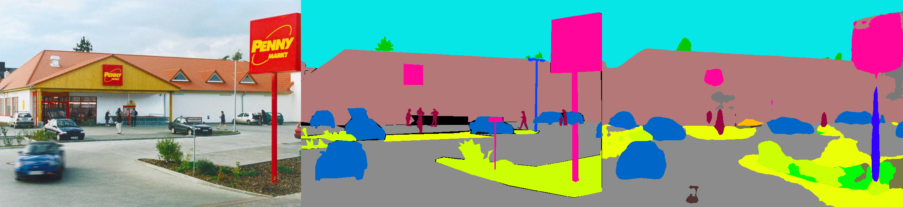

# Semantic Segmentation on MIT ADE20K dataset in PyTorch

This is a PyTorch implementation of semantic segmentation models on MIT ADE20K scene parsing dataset.

ADE20K is the largest open source dataset for semantic segmentation and scene parsing, released by MIT Computer Vision team. Follow the link below to find the repository for our dataset and implementations on Caffe and Torch7:
https://github.com/CSAILVision/sceneparsing

Pretrained models can be found at:
http://sceneparsing.csail.mit.edu/model/



From left to right: Test Image, Ground Truth, Predicted Result

## Supported models:
We split our models into encoder and decoder, where encoders are usually modified directly from classification networks, and decoders consist of final convolutions and upsampling.

Encoder:
- vgg16_dilated8
- vgg19_dilated8
- resnet34_dilated16
- resnet34_dilated8
- resnet50_dilated16
- resnet50_dilated8

(resnetXX_dilatedYY: customized resnetXX with dilated convolutions, output feature map is 1/YY of input size.)

Decoder:
- c1_bilinear (1 conv + bilinear upsample)
- psp_bilinear (pyramid pooling + bilinear upsample, see PSPNet paper for details)


## Performance:
IMPORTANT: One obstacle to a good dilated ResNet model is that batch normalization layers are usually not well trained with a small batch size (<16). Ideally, batch size >64 will get you the best results. In this repo, we trained customized ResNet on Places365 (will be automatically downloaded when needed) as the initialization for scene parsing model, which partly solved the problem. You can simply set ```--fix_bn 1``` to freeze BN parameters during training.

- resnet34_dilated8 + c1_bilinear: Mean IoU 0.3277, Accuracy: 76.47% 

- resnet34_dilated8 + psp_bilinear: Mean IoU 0.3634, Accuracy: 77.98% 

- resnet50_dilated8 + c1_bilinear: Mean IoU 0.3385, Accuracy: 76.40% 

- resnet50_dilated8 + psp_bilinear: Mean IoU 0.3800, Accuracy: 78.21% 

## Environment
The code is developed under the following configurations.
- Hardware: 2-8 Pascal Titan X GPUs (change ```[--num_gpus NUM_GPUS]``` accordingly)
- Software: Ubuntu 14.04, CUDA8.0, Python2.7, PyTorch 0.2.0

## Training
1. Download the ADE20K scene parsing dataset:
```bash
chmod +x download_ADE20K.sh
./download_ADE20K.sh
```
2. Train a network (default: resnet34_dilated8). During training, checkpoints will be saved in folder ```ckpt```, visual results will be saved in folder ```vis```.
```bash
python train.py
```

3. Input arguments: (see full input arguments via ```python train.py -h ```)
```bash
usage: train.py [-h] [--id ID] [--arch_encoder ARCH_ENCODER]
                [--arch_decoder ARCH_DECODER]
                [--weights_encoder WEIGHTS_ENCODER]
                [--weights_decoder WEIGHTS_DECODER] [--fc_dim FC_DIM]
                [--list_train LIST_TRAIN] [--list_val LIST_VAL]
                [--root_img ROOT_IMG] [--root_seg ROOT_SEG]
                [--num_gpus NUM_GPUS]
                [--batch_size_per_gpu BATCH_SIZE_PER_GPU]
                [--num_epoch NUM_EPOCH] [--optim OPTIM]
                [--lr_encoder LR_ENCODER] [--lr_decoder LR_DECODER]
                [--beta1 BETA1]
                [--weight_decay WEIGHT_DECAY] [--fix_bn FIX_BN]
                [--num_val NUM_VAL] [--workers WORKERS] [--imgSize IMGSIZE]
                [--segSize SEGSIZE] [--num_class NUM_CLASS]
                [--seed SEED] [--ckpt CKPT] [--vis VIS]
                [--disp_iter DISP_ITER] [--eval_epoch EVAL_EPOCH]
                [--ckpt_epoch CKPT_EPOCH]
```


## Evaluation
1. Evaluate a trained network on the validation set:
```bash
python eval.py --id MODEL_ID
```

2. Input arguments: (see full input arguments via ```python eval.py -h ```)
```bash
usage: eval.py [-h] --id ID [--suffix SUFFIX] [--arch_encoder ARCH_ENCODER]
               [--arch_decoder ARCH_DECODER] [--fc_dim FC_DIM]
               [--list_val LIST_VAL] [--root_img ROOT_IMG]
               [--root_seg ROOT_SEG] [--num_val NUM_VAL]
               [--batch_size BATCH_SIZE] [--imgSize IMGSIZE]
               [--segSize SEGSIZE] [--num_class NUM_CLASS] [--ckpt CKPT]
               [--visualize VISUALIZE] [--result RESULT]
```


## Test/Inference
1. Do inference on a single image:
```bash
python test.py --ckpt CKPT_PATH --id MODEL_ID --test_img TEST_IMG
```
2. Input arguments: (see full input arguments via ```python test.py -h ```)
```bash
usage: test.py [-h] --id ID [--suffix SUFFIX] [--arch_encoder ARCH_ENCODER]
               [--arch_decoder ARCH_DECODER] [--fc_dim FC_DIM] --test_img
               TEST_IMG [--num_val NUM_VAL] [--batch_size BATCH_SIZE]
               [--imgSize IMGSIZE] [--segSize SEGSIZE] [--num_class NUM_CLASS]
               [--ckpt CKPT] [--visualize VISUALIZE] [--result RESULT]
```

## Reference

If you find the code or pre-trained models useful, please cite the following paper:

Scene Parsing through ADE20K Dataset. B. Zhou, H. Zhao, X. Puig, S. Fidler, A. Barriuso and A. Torralba. Computer Vision and Pattern Recognition (CVPR), 2017. (http://people.csail.mit.edu/bzhou/publication/scene-parse-camera-ready.pdf)

    @inproceedings{zhou2017scene,
        title={Scene Parsing through ADE20K Dataset},
        author={Zhou, Bolei and Zhao, Hang and Puig, Xavier and Fidler, Sanja and Barriuso, Adela and Torralba, Antonio},
        booktitle={Proceedings of the IEEE Conference on Computer Vision and Pattern Recognition},
        year={2017}
    }
    
Semantic Understanding of Scenes through ADE20K Dataset. B. Zhou, H. Zhao, X. Puig, S. Fidler, A. Barriuso and A. Torralba. arXiv:1608.05442. (https://arxiv.org/pdf/1608.05442.pdf)

    @article{zhou2016semantic,
      title={Semantic understanding of scenes through the ade20k dataset},
      author={Zhou, Bolei and Zhao, Hang and Puig, Xavier and Fidler, Sanja and Barriuso, Adela and Torralba, Antonio},
      journal={arXiv preprint arXiv:1608.05442},
      year={2016}
    }
